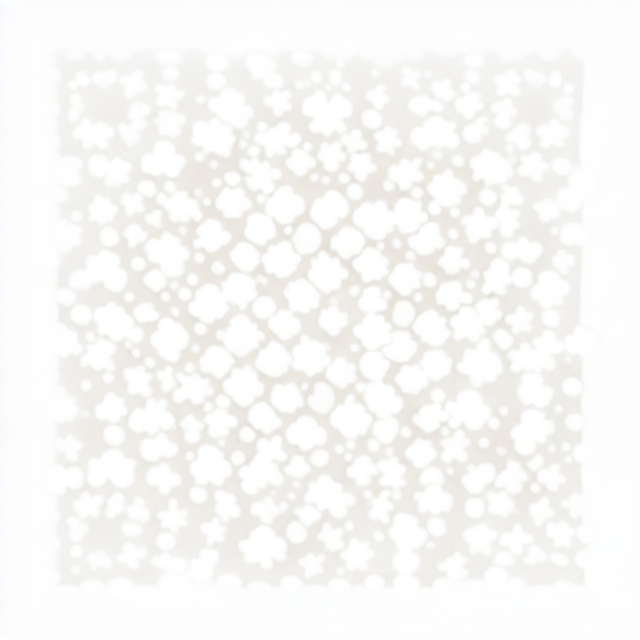

# Генератор QR-кодов с арт-визуализацией на основе машинного обучения

<div align="center">
  
  
  
  
  
</div>

## 📋 Описание проекта

Консольное приложение на Python для генерации как **классических** чёрно-белых QR‑кодов, так и **артовых** QR‑кодов с использованием современных моделей машинного обучения (Stable Diffusion + ControlNet). Артовые QR‑коды представляют собой уникальные изображения, в которые интегрирована структура QR‑кода, что позволяет использовать их в дизайне, маркетинге и рекламе без потери читаемости.

Проект разработан в рамках итоговой работы по курсу **«Python-разработчик»** (Кейс №6) и демонстрирует комплексное применение Python, ML и ИИ-инструментов.

---

## 🎯 Функциональные возможности

### Классическая генерация
- ✅ Генерация QR‑кода из любого текста или URL
- ✅ Настройка версии (1–40), уровня коррекции ошибок (L, M, Q, H), размера модуля и цветов
- ✅ Автоматическое сохранение в PNG с уникальным именем (временная метка + индекс при конфликте)
- ✅ Просмотр истории операций (логирование всех действий)

### Арт-генерация (с использованием ML)
- ✅ Создание эстетически привлекательного изображения на основе текстового описания (промпта)
- ✅ Автоматическое встраивание QR‑кода в сгенерированное изображение с сохранением его структуры
- ✅ Возможность задать собственный промпт или использовать стандартный
- ✅ Настройка ключевых параметров: `CONTROLNET_SCALE`, `STRENGTH`, `GUIDANCE_SCALE`, `STEPS`
- ✅ Постобработка для повышения резкости и контраста (опционально)
- ✅ Автоматическая проверка сканируемости (при установленном `pyzbar`)
- ✅ Поддержка разных моделей ControlNet (для разных балансов красоты и читаемости)

---

## 🛠 Технологии и инструменты

| Компонент | Технология |
|-----------|------------|
| Язык программирования | Python 3.8+ |
| Классическая генерация QR | `qrcode` + `Pillow` |
| ML-генерация | `diffusers`, `transformers`, `torch`, `accelerate` |
| Модели | `Stable Diffusion 1.5` (базовая), `ControlNet` для QR‑кодов |
| Валидация ввода | Сгенерирована с помощью ChatGPT |
| Обработка ошибок | Сгенерирована с помощью Cursor AI |
| Логирование | Встроенная библиотека `logging` |
| Управление зависимосями | `venv` + `pip` |
| Система контроля версий | Git + GitHub |

---

## 📦 Установка и запуск

### 1. Клонирование репозитория
```bash
git clone https://github.com/ваш_username/qr-code-generator.git
cd qr-code-generator
```

### 2. Создание виртуального окружения (рекомендуется)

**Windows:**
```bash
python3 -m venv venv
venv\Scripts\activate
```

**macOS / Linux:**
```bash
python3 -m venv venv
source venv/bin/activate
```

### 3. Установка зависимостей
```bash
pip install -r requirements.txt
```

> **Примечание:** Для ускорения ML-генерации на NVIDIA GPU установите PyTorch с поддержкой CUDA (например, `pip install torch torchvision torchaudio --index-url https://download.pytorch.org/whl/cu118`).

### 4. Запуск программы
```bash
python3 main.py
```

---

## 🚀 Использование

После запуска появится главное меню:

```
==================================================
          ГЕНЕРАТОР QR-КОДОВ
==================================================
1. Ввести данные для кодирования
2. Настроить параметры генерации
3. Сгенерировать и сохранить QR-код
4. Просмотреть историю (лог)
5. Выйти
6. ✨ Сгенерировать артовый QR-код (ML)
==================================================
```

### Классический режим (пункты 1–3)
1. Введите текст или URL (пункт 1).
2. При необходимости настройте параметры (пункт 2).
3. Сгенерируйте и сохраните QR‑код (пункт 3) – файл появится в папке проекта.

### Арт-режим (пункт 6)
1. Убедитесь, что данные для кодирования введены (пункт 1).
2. Выберите пункт 6, подтвердите генерацию.
3. При желании введите собственный промпт (описание изображения) на английском языке.
4. Дождитесь завершения генерации (30–60 секунд на GPU).
5. Полученный артовый QR‑код сохранится в файл с префиксом `artistic_qr_*`.

### Пример полученного QR-кода


> **Примечание:** При реальном использовании программа создаёт PNG-файл, который можно открыть и отсканировать.

### Пример полученного арт QR-кодов




> **Примечание:** Для получения качественного изображения арт qr-кода требуется больше времени для настройки параметров

---

## 🧠 Параметры ML-генерации (файл `config.py`)

Для тонкой настройки баланса между **красотой** и **читаемостью** используйте следующие параметры:

| Параметр | Значение по умолчанию | Влияние на результат |
|----------|----------------------|----------------------|
| `QR_SIZE` | 512 | Размер изображения (пикселей). Чем больше, тем чётче модули QR, но выше нагрузка на GPU. |
| `CONTROLNET_SCALE` | 1.3 | Вес влияния ControlNet на форму QR‑кода. **Выше** (1.3–1.8) → строже форма, выше читаемость. **Ниже** (0.8–1.2) → больше артистизма, но риск потери сканируемости. |
| `STRENGTH` | 0.6 | Сила изменения исходного QR‑изображения. **Выше** (0.7–0.9) → креативнее, но менее чётко. **Ниже** (0.4–0.6) → сохраняет структуру QR. |
| `STEPS` | 30 | Количество шагов денойзинга. **Больше** (40–50) → выше качество, но медленнее. **Меньше** (15–25) → быстрее, хуже детализация. |
| `GUIDANCE_SCALE` | 9.0 | Коэффициент следования промпту (CFG scale). **Выше** (9–12) → ярче, насыщеннее, строже соответствует описанию. **Ниже** (6–8) → более свободная интерпретация. |
| `SEED` | 42 | Зерно случайности для воспроизводимости. Фиксированное значение даёт одинаковый результат. `None` – каждый раз уникальный. |
| `BASE_SD_MODEL_ID` | `runwayml/stable-diffusion-v1-5` | Базовая модель Stable Diffusion. Можно заменить на другие (например, `dreamlike-art/dreamlike-photoreal-2.0`). |
| `CONTROLNET_MODEL_ID` | `DionTimmer/controlnet_qrcode-control_v1p_sd15` | Модель ControlNet для QR‑кодов. Альтернативы: `monster-labs/control_v1p_sd15_qrcode_monster` (более читаемая). |

### Как настроить для получения читаемого артового QR‑кода?

1. **Если код не сканируется:** увеличьте `CONTROLNET_SCALE` до 1.5–1.8, уменьшите `STRENGTH` до 0.4–0.5.
2. **Если изображение слишком блёклое:** увеличьте `GUIDANCE_SCALE` до 9–10, улучшите промпт (добавьте слова *vibrant, high contrast, vivid*).
3. **Если изображение слишком «плоское»:** попробуйте заменить `BASE_SD_MODEL_ID` на `dreamlike-art/dreamlike-photoreal-2.0`.
4. **Для максимальной читаемости:** используйте `monster-labs/control_v1p_sd15_qrcode_monster` и установите `CONTROLNET_SCALE = 1.5`, `STRENGTH = 0.5`.

---

## 🤖 Использование ИИ-инструментов в разработке

- **ChatGPT** – генерация функций валидации ввода (проверка текста, версии, цвета), регулярных выражений, обработки ошибок при работе с файлами.
- **Cursor AI / GitHub Copilot** – автодополнение кода для логирования, обработки конфликтов имён файлов, документирования функций.
- **Примеры запросов:**
  - *«Напиши функцию на Python для валидации ввода текста для QR-кода: проверка на пустую строку и максимальную длину 4296 символов»*
  - *«Сгенерируй регулярное выражение для проверки названия цвета и HEX-кода (#RGB, #RRGGBB)»*

---

## 📝 Логирование

Все действия пользователя и ошибки записываются в файл `qr_generator.log` с временными метками:

```
[2026-06-24 16:46:48] Программа запущена
[2026-06-24 16:47:21] Установлена версия: 39
[2026-06-24 16:47:28] Установлен уровень коррекции: M
[2026-06-24 16:47:36] Установлен размер модуля: 2
[2026-06-24 16:47:48] Установлен цвет кода: green
[2026-06-24 16:47:56] Установлен цвет фона: yellow
[2026-06-24 16:48:44] Введены данные: https://www.odin.study
[2026-06-24 16:49:09] QR-код сгенерирован для данных: https://www.odin.study
[2026-06-24 16:49:10] QR-код сохранён в файл: qr_code_20260624_164909.png
[2026-06-24 16:49:10] Файл сохранён: qr_code_20260624_164909.png
[2026-06-24 16:56:49] Программа завершена
[2026-06-24 17:37:45] Программа запущена
[2026-06-24 17:39:42] Введены данные: https://mail.ru
[2026-06-24 17:40:04] QR-код сгенерирован для данных: https://mail.ru
[2026-06-24 17:40:04] QR-код сохранён в файл: qr_code_20260624_174004.png
[2026-06-24 17:40:04] Файл сохранён: qr_code_20260624_174004.png
[2026-06-24 17:41:09] Программа завершена
[2026-06-25 12:29:07] Программа запущена
[2026-06-25 12:30:32] Введены данные: https://ya.ru
[2026-06-25 12:31:11] Установлена версия: 5
[2026-06-25 12:31:36] Установлен цвет кода: red
[2026-06-25 12:34:44] Начало генерации артового QR для: https://ya.ru...
[2026-06-25 12:34:44] Загрузка ControlNet модели: DionTimmer/controlnet_qrcode-control_v1p_sd15
[2026-06-25 12:41:13] Загрузка базовой модели: runwayml/stable-diffusion-v1-5
[2026-06-25 12:58:42] Артовый QR-код успешно сгенерирован
[2026-06-25 12:58:42] Артовый QR-код сохранён как artistic_qr_20260625_125842.png
```

---

## 🧪 Тестирование

Программа протестирована на следующих сценариях:

| Сценарий | Ожидаемый результат | Статус |
|----------|---------------------|--------|
| Ввод корректного текста | Данные приняты, QR‑код сгенерирован | ✅ |
| Ввод пустой строки | Сообщение об ошибке | ✅ |
| Ввод длинного текста (>4296 символов) | Сообщение об ошибке | ✅ |
| Неверная версия QR‑кода | Сообщение об ошибке | ✅ |
| Генерация артового QR с ControlNet | Изображение создано, QR сканируется | ✅ |
| Артовый QR с пользовательским промптом | Генерация с учётом описания | ✅ |
| Конфликт имён файла | Автоматическое добавление индекса | ✅ |
| Отсутствие прав на запись | Обработка исключения, запись в лог | ✅ |

---

## 🔧 Устранение неполадок

| Проблема | Решение |
|----------|---------|
| **Ошибка загрузки модели (модель не найдена)** | Проверьте `BASE_SD_MODEL_ID` и `CONTROLNET_MODEL_ID` в `config.py`. Убедитесь, что идентификаторы верны. |
| **Артовый QR не сканируется** | Увеличьте `CONTROLNET_SCALE` (1.5–1.8) и уменьшите `STRENGTH` (0.4–0.5). Используйте модель `monster-labs/control_v1p_sd15_qrcode_monster`. |
| **Изображение блёклое** | Увеличьте `GUIDANCE_SCALE` до 9–10, добавьте в промпт *vibrant, high contrast*. |
| **Ошибка несовместимости размерностей (mat1 and mat2)** | Убедитесь, что базовая модель и ControlNet имеют одинаковую размерность (например, обе для SD 1.5). |
| **Не хватает памяти GPU** | Уменьшите `QR_SIZE` до 256 или 320, уменьшите `STEPS` до 15–20. |
| **Генерация слишком медленная на CPU** | Используйте Google Colab или уменьшите параметры (`QR_SIZE=256`, `STEPS=15`). |

---

## 🔮 Возможные пути улучшения

- 🖥 Добавление графического интерфейса (Tkinter, PyQt)
- 📦 Пакетная генерация из CSV или текстового файла
- 🎨 Поддержка анимации и 3D-эффектов
- 🌐 Веб-интерфейс на Flask/Django
- 🔗 Интеграция с облачными API (Replicate, Hugging Face Inference)
- 📱 Мобильное приложение для генерации на телефоне

---

## 📄 Лицензия

Этот проект создан в образовательных целях в рамках курса «Python-разработчик». Свободно используется и модифицируется для обучения.

---

## 👨‍💻 Автор

**Oleg Baranov**
Группа: ПР-2-Р
Курс: Python-разработчик с использованием инструментов ИИ
Год: 2026

---

## 📚 Источники

- [Документация библиотеки qrcode](https://pypi.org/project/qrcode/)
- [Документация Pillow (PIL)](https://python-pillow.org/)
- [Документация diffusers](https://huggingface.co/docs/diffusers)
- [ControlNet для QR-кодов – DionTimmer](https://huggingface.co/DionTimmer/controlnet_qrcode-control_v1p_sd15)
- [Stable Diffusion 1.5 – runwayml](https://huggingface.co/runwayml/stable-diffusion-v1-5)
- [Статья «Артовые QR-коды с ControlNet»](https://tsecurity.de)

---

## 📧 Контакты

- GitHub: [github.com/bosone87](https://github.com/bosone87
- Email: bos.one@mail.ru

---

## 🙏 Благодарности

Благодарю преподавателей и наставников курса «Python-разработчик» за ценные знания и поддержку.