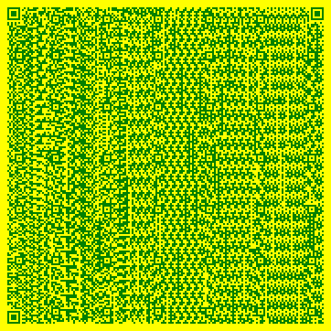

# Генератор QR-кодов

<div align="center">
  
  
  
  
</div>

## 📋 Описание проекта

Консольное приложение на Python для генерации QR-кодов из текста или URL-адресов. Программа позволяет настраивать параметры генерации, сохранять результат в PNG-файл с автоматическим уникальным именем, ведёт логирование всех операций и использует ИИ-инструменты для валидации ввода и обработки ошибок.

Этот проект разработан в рамках итоговой работы по курсу **«Python-разработчик»** (Кейс №6).

---

## 🎯 Функциональные возможности

- ✅ Генерация QR-кода из любого текста или URL-адреса
- ✅ Настройка параметров QR-кода:
  - Версия (размер) от 1 до 40
  - Уровень коррекции ошибок (L, M, Q, H) (способность QR-кода восстанавливать данные, даже если часть изображения повреждена, засорена или закрыта. Чем выше уровень, тем больше «лишней» информации добавляется в код, и тем больше повреждений он может пережить)
  - Размер модуля (пикселей)
  - Цвет кода и фона (название цвета или HEX-код)
- ✅ Автоматическое сохранение в PNG-файл с уникальным именем (временная метка)
- ✅ Автоматическое разрешение конфликтов имён (добавление индекса)
- ✅ Логирование всех действий и ошибок в файл
- ✅ Просмотр истории операций из программы
- ✅ Валидация пользовательского ввода с понятными сообщениями
- ✅ Обработка всех исключительных ситуаций (деление на ноль, ошибки файловой системы и т.д.)

---

## 🛠 Технологии и инструменты

| Компонент | Технология |
|-----------|------------|
| Язык программирования | Python 3.8+ |
| Генерация QR-кодов | `qrcode` + `Pillow` |
| Логирование | Встроенная библиотека `logging` |
| Валидация ввода | Сгенерирована с помощью ChatGPT |
| Обработка ошибок | Сгенерирована с помощью Cursor AI |
| Управление зависимостями | `venv` + `pip` |
| Система контроля версий | Git + GitHub |

---

## 📦 Установка и запуск

### 1. Клонирование репозитория

```bash
git clone https://github.com/ваш_username/qr-code-generator.git
cd qr-code-generator
```

### 2. Создание виртуального окружения (рекомендуется)

**Windows:**
```bash
python -m venv venv
venv\Scripts\activate
```

**macOS / Linux:**
```bash
python3 -m venv venv
source venv/bin/activate
```

### 3. Установка зависимостей

```bash
pip install -r requirements.txt
```

### 4. Запуск программы

```bash
python3 main.py
```

---

## 🔧 Альтернативные способы установки зависимостей

Если установка через `requirements.txt` вызывает ошибки (например, с `Pillow`), попробуйте один из следующих способов:

### Способ 1 (рекомендуемый) – установка только готовых бинарных пакетов

```bash
pip install --only-binary :all: Pillow
pip install qrcode
```

### Способ 2 – установка конкретных стабильных версий

```bash
pip install Pillow==9.5.0
pip install qrcode==7.3.1
```

### Способ 3 – для Linux / macOS (установка системных зависимостей)

**Debian/Ubuntu:**
```bash
sudo apt-get update
sudo apt-get install -y libjpeg-dev zlib1g-dev libpng-dev
pip install Pillow qrcode
```

**macOS:**
```bash
brew install libjpeg zlib
pip install Pillow qrcode
```

### Способ 4 – для Windows (установка Microsoft C++ Build Tools)

Если ошибки сборки Pillow сохраняются, установите [Microsoft C++ Build Tools](https://visualstudio.microsoft.com/ru/downloads/#build-tools-for-visual-studio-2022) с компонентом «Разработка классических приложений на C++».

---

## 📁 Структура проекта

```
qr-code-generator/
├── main.py              # Точка входа, консольное меню
├── qr_generator.py      # Логика генерации и сохранения QR-кода
├── validator.py         # Валидация ввода (сгенерирована с помощью ИИ)
├── logger.py            # Логирование действий и ошибок
├── config.py            # Настройки по умолчанию
├── requirements.txt     # Список зависимостей
├── README.md            # Документация (этот файл)
├── .gitignore           # Исключения для Git
└── qr_generator.log     # Лог-файл (создаётся автоматически)
```

---

## 🖥 Пример работы программы

### Главное меню

```
==================================================
          ГЕНЕРАТОР QR-КОДОВ
==================================================
1. Ввести данные для кодирования
2. Настроить параметры генерации
3. Сгенерировать и сохранить QR-код
4. Просмотреть историю (лог)
5. Выйти
==================================================

📌 Текущие параметры:
   Данные: ✅ заданы
   Версия: 39
   Уровень коррекции: M
   Размер модуля: 2
   Цвет кода: green
   Цвет фона: yellow
```

### Ввод данных

```
--- Ввод данных для QR-кода ---
Введите текст или URL: https://www.odin.study
✅ Данные сохранены: https://www.odin.study
```

### Генерация QR-кода

```
--- Генерация QR-кода ---
📝 Данные для кодирования: https://www.odin.study
⚙️  Параметры: версия=39, коррекция=M, размер=2
✅ QR-код успешно сгенерирован!
💾 Будет создан файл: qr_code_20260624_164909.png
✅ QR-код сохранён в файл: qr_code_20260624_164909.png
```

### Пример полученного QR-кода



> **Примечание:** При реальном использовании программа создаёт PNG-файл, который можно открыть и отсканировать.

---

## 🤖 Использование ИИ-инструментов в разработке

В процессе разработки были использованы следующие ИИ-инструменты:

### 1. ChatGPT
- **Валидация ввода** – генерация функций проверки текста, версии, уровня коррекции, цвета и имени файла.
- **Регулярные выражения** – создание шаблонов для проверки HEX-кодов и допустимых символов.
- **Обработка ошибок** – генерация кода для перехвата и обработки исключений при работе с файлами.

**Примеры запросов:**
- *«Напиши функцию на Python для валидации ввода текста для QR-кода: проверка на пустую строку и максимальную длину 4296 символов»*
- *«Сгенерируй регулярное выражение для проверки названия цвета и HEX-кода (#RGB, #RRGGBB)»*

### 2. Cursor AI / GitHub Copilot
- **Обработка файлов** – генерация кода для проверки существования файла и автоматического добавления индекса при конфликте.
- **Логирование** – автодополнение кода для записи логов с временными метками.
- **Документирование** – помощь в написании docstring и комментариев.

---

## 📝 Логирование

Все действия пользователя и ошибки записываются в файл `qr_generator.log`:

```
[2026-06-24 16:46:48] Программа запущена
[2026-06-24 16:47:21] Установлена версия: 39
[2026-06-24 16:47:28] Установлен уровень коррекции: M
[2026-06-24 16:47:36] Установлен размер модуля: 2
[2026-06-24 16:47:48] Установлен цвет кода: green
[2026-06-24 16:47:56] Установлен цвет фона: yellow
[2026-06-24 16:48:44] Введены данные: https://www.odin.study
[2026-06-24 16:49:09] QR-код сгенерирован для данных: https://www.odin.study
[2026-06-24 16:49:10] QR-код сохранён в файл: qr_code_20260624_164909.png
[2026-06-24 16:49:10] Файл сохранён: qr_code_20260624_164909.png
[2026-06-24 16:56:49] Программа завершена
```

---

## 🧪 Тестирование

Программа была протестирована на следующих сценариях:

| Сценарий | Ожидаемый результат | Статус |
|----------|---------------------|--------|
| Ввод корректного текста | Данные приняты, QR-код сгенерирован | ✅ |
| Ввод пустой строки | Сообщение об ошибке | ✅ |
| Ввод очень длинного текста (>4296 символов) | Сообщение об ошибке | ✅ |
| Ввод неверной версии (например, 50) | Сообщение об ошибке | ✅ |
| Ввод неверного уровня коррекции | Сообщение об ошибке | ✅ |
| Конфликт имён файла | Автоматическое добавление индекса | ✅ |
| Отсутствие прав на запись | Обработка исключения, запись в лог | ✅ |
| Генерация с разными цветами | QR-код создаётся с указанными цветами | ✅ |

---

## 🔮 Возможные пути улучшения

- 🖥 Добавление графического интерфейса (Tkinter, PyQt)
- 📦 Пакетная генерация из CSV или текстового файла
- 🎨 Поддержка дополнительных форматов (SVG, PDF)
- 🔗 Валидация URL-адресов
- 📊 Статистика использования
- 🌐 Веб-интерфейс на Flask/Django
- 📱 Создание мобильного приложения

---

## 📄 Лицензия

Этот проект создан в образовательных целях в рамках курса «Python-разработчик с использованием инструментов ИИ». Свободно используется и модифицируется для обучения.

---

## 👨‍💻 Автор

**Oleg Baranov**
Группа: ПР-2-Р
Курс: Python-разработчик с использованием инструментов ИИ
Год: 2026  

---

## 📚 Источники

- [Документация библиотеки qrcode](https://pypi.org/project/qrcode/)
- [Документация Pillow (PIL)](https://python-pillow.org/)
- [Стандарт PEP 8 – стиль кода Python](https://peps.python.org/pep-0008/)
- [Материалы курса Python-разработчик](https://lms.example.com)
- [Статья «Как сгенерировать QR-код на Python»](https://tsecurity.de)

---

## 📧 Контакты

- GitHub: [github.com/bosone87](https://github.com/bosone87)
- Email: bos.one@mail.ru

---

## 🙏 Благодарности

Благодарю преподавателей и наставников курса «Python-разработчик с использованием инструментов ИИ» за ценные знания и поддержку.